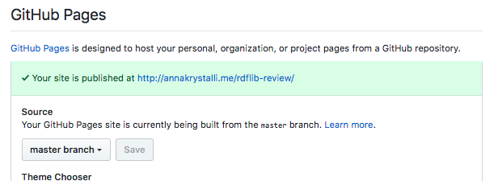

## 1. Create GitHub repo and add it as a remote to your review project

Currently we've not integrated the creation of an remote GitHub repo but we're exploring this functionality also. In the mean time, you **can create a repo to publish your review in two ways:**

### Manually through GitHub

1. Head over to to your **repositories tab** on [**Github**](https://github.com).

1. Click on **New** to create a **blank** repository.
    - Follow naming convention `"{pkgname}-review"`.
    - Make sure you **don't automatically create any files on GitHub**. These will cause merge conflicts when you try to push to the remote for the first time.
    

1. Click on **Clone or download** and **copy the link** displayed


1. **Open a terminal** (in Rstudio go to _Tools > Terminal > New Terminal_). In the terminal, ensure you are in the review project.

1. **Add your github repo as a remote** by running the following code in the terminal, **substituting in the link you copied** from GitHub.

    ```
    git remote add origin <the-link-you-copied-from-github>
    git push -u origin master
    ```
  For example, in my case I add my repo to as a remote like so:

    ```
    git remote add origin https://github.com/annakrystalli/rdflib-review.git
    git push -u origin master
    ```
  Follow any authentication steps required

****

### **Programmatically using `usethis::use_github()`**

To use `usethis::use_github`, you'll need to supply a **github personal access token (PAT) token**. The easiest way to set it up for all your r workflows is to store you PAT in a `GITHUB_PAT` system variable in your [.Renviron](https://csgillespie.github.io/efficientR/3-3-r-startup.html#renviron) dotfile.  To do this:

1. **Generate PAT**: [visit github, follow instruction to generate a PAT](https://help.github.com/articles/creating-a-personal-access-token-for-the-command-line/). 

2. **[Add PAT to your `.Renviron`](https://github.com/jennybc/happy-git-with-r/blob/master/81_github-api-tokens.Rmd) dot file**: Use `usethis::edit_r_environ()` to open your user level `.Renviron`, paste the copied PAT token from github and save it like so:


3. **Create Github repo & add as remote:** Now, while in your review project in Rstudio, run: 

    ```r
    usethis::use_github()
    ```
  to create a github repository for your review and add it as a remote for your review project. The naming of the github repository is handled automatically.

<div class="alert alert-warning">
  <strong>Warning!</strong> Because of ongoing big changes in dependency `git2r`, you may encounter authentication problems with `usethis::use_github()`. Refer to this <a href="https://community.rstudio.com/t/difficulty-using-usethis-use-github/5579/4"> discussion thread for further details.</a>
</div>

<br>

***

## 2. Commit the review files and push them to github

+ In the **`git` panel** in Rstudio, **select the files you want to share on github**. You can chose to only share `index.nb.html`, the rendered report or include the `index.Rmd`. Also select `README.md` so your repository has an appropriate README from which your review can be accessed.

+ **Commit** the files adding an appropriate commit message

+ **Push** your changes to GitHub

<br>

***

## 3. Enable GitHub Pages

+ In your review GitHub repository click on **Settings**

+ Scroll down to the **GitHub Pages** section and change **Source** location to **master branch**

  

+ **Github Pages is now enabled and your report review [will be published](http://annakrystalli.me/rdflib-review/index.nb.html) at the link displayed:**

  
